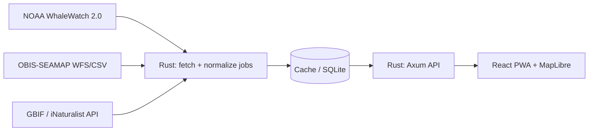

# Spout (California Coast Whale Tracker): Feasibility & Architecture

*As of 2026-09-18*

## Verdict

A live, flight-tracker-style whale tracker is not buildable on free public data today; whales don't broadcast a continuous position the way aircraft or ships do, and no source combines free access, a real API, and true real-time coverage of the California coast. What is buildable, entirely on free data, is a **presence and probability visualizer**: NOAA's blue whale likelihood model layered with recent confirmed sightings from OBIS-SEAMAP and citizen-science occurrence records from GBIF/iNaturalist. That's a real gap in the market, since none of the three sources currently offers a good mobile experience on their own. Recommended v1 scope: a read-only, mobile-first PWA showing those three layers on one map, honest about how fresh each pin is.

## Data Sources & Licensing

Three free sources cover the app's v1 needs. None is instantaneous, and each carries its own attribution rule that has to live somewhere permanent in the app, not just in this doc.

| Source | What it provides | Update cadence | Programmatic access | Attribution / license |
| --- | --- | --- | --- | --- |
| NOAA WhaleWatch 2.0 | Blue whale presence probability, 10km grid cells, U.S. West Coast | Near-real-time model refresh | No confirmed public API yet. Currently a map/explorer tool; worth a direct email to the CoastWatch team to ask about ERDDAP access | U.S. government work, public domain; credit NOAA/CoastWatch as source |
| OBIS-SEAMAP | Satellite-tag and sighting datasets contributed by research groups (including Cascadia Research, Happywhale) | Uploaded by researchers on their own schedule, days to months after the fact | Yes: OGC WMS/WFS, CSV/KML export, queryable by species and date via URL parameters | Set per dataset (CC-BY or CC-BY-NC; a few require the provider's permission). Credit the *contributing* dataset, not just OBIS-SEAMAP |
| GBIF / iNaturalist research-grade | Citizen-photographed sightings with species ID, location, date | Hours to days after upload and community ID confirmation | Yes: GBIF's documented REST Occurrence API | CC0/CC-BY per record; GBIF requires a dataset citation when its data is republished |

A permanent "Data & Credits" panel in the app, listing each source with its citation, is the cleanest way to stay compliant as more datasets get pulled in.

## Product Concept

One full-screen map of the California coast, mobile-first, opening centered on the user's location or the whole coastline by default. Three layers sit on top, each visually distinct so the user always knows what kind of information they're looking at:

1. **Probability layer**, a soft heatmap or shaded region from NOAA WhaleWatch, answering "where are whales statistically likely this week."
2. **Confirmed sightings layer**, discrete pins from OBIS-SEAMAP, tappable for species/date/source, fading or graying out as they age so a two-month-old sighting doesn't read as current.
3. **Citizen occurrence layer**, lighter-weight, distinctly styled pins from GBIF/iNaturalist, clearly marked as unverified photo reports rather than research data.

A thin, collapsible control bar handles time filtering (today / this week / this month) and species filtering (blue, humpback, gray, orca). Tapping any pin or region opens a small detail card in place, keeping the whole thing a true single-page app rather than navigating to new screens.

## Use Cases

| Persona | Primary need | Layers relied on most |
| --- | --- | --- |
| Whale-watch trip planner | Decide whether this weekend, and which departure point, gives good odds | Probability + confirmed sightings |
| Boater, sailor, kayaker | Situational awareness on the water | Confirmed sightings + probability |
| Photographer / wildlife enthusiast | Find current hotspots worth chasing | Confirmed sightings + citizen occurrence |
| Educator / conservation or tourism org | Teaching aid, community engagement, embeddable reference | All three, for narrative context |
| Future citizen-science contributor | Log and see their own sighting reflected back | A submission layer, phase 2 (not v1) |

The common thread across the first four is that none of them can currently get this view in one place: Whale Safe covers only part of the coast with no API, NOAA's tool is built for scientists, and OBIS-SEAMAP is a raw research portal. A friendly layer over all three is the actual product.

## Tech Stack Decision

**Frontend:** TypeScript + React + Vite, built mobile-first and installable as a PWA, using MapLibre GL JS (a fully open-source fork of pre-license-change Mapbox GL JS) for the map. MapLibre paired with a free vector tile source (OpenFreeMap or MapTiler's free tier) carries zero usage-based billing risk at any traffic level, which matters for a bootstrapped app whose usage is unknown. Mapbox GL JS remains a fine fallback (50,000 free map loads/month, $5/1,000 after) if MapLibre's tile quality or feature set ever falls short.

**Backend:** a small Rust service (Axum) that fetches, normalizes, and caches the three data sources server-side, then exposes one clean JSON API to the frontend. This gives Rust a meaningful role, avoids CORS and per-source rate-limit problems by proxying through one place, and keeps the three very different data formats (NOAA's grid, OBIS-SEAMAP's WFS/CSV, GBIF's JSON) behind a single normalized contract.

**On Tauri:** Tauri 2.0 does support iOS/Android now (stable since October 2024), so a Rust-and-webview native app is genuinely possible later. Its mobile tooling is newer and less proven than its desktop story, so the plan is to validate the concept as a web PWA first, then wrap the same frontend in Tauri 2 for app-store distribution once it's clear people actually use this.

## System Architecture



**Backend responsibilities (Rust / Axum):**

1. Scheduled fetch jobs, one per source, each running on that source's own realistic cadence rather than a single shared poll interval.
2. A normalization layer that maps all three formats into one shared `Sighting` shape: `{ id, species, lat, lon, observed_at, source, confidence, attribution_url }`. This shared type is also what backend and frontend tests validate against (see Open Questions).
3. A cache (SQLite is enough at this scale) so the frontend never waits on a slow upstream source and so re-fetching stays polite to NOAA/OBIS/GBIF's own rate limits.
4. A single REST API for the frontend, e.g. `GET /api/sightings?bbox=&since=&species=&source=` for pins, and `GET /api/probability?week=` for the heatmap grid.

**Frontend structure (TypeScript / React):** a `Map` component owning the MapLibre instance; three layer components (`ProbabilityLayer`, `SightingsLayer`, `CitizenLayer`) that each own their own visual styling and fetch hook; a `FilterBar` component for time/species; a `SightingDetailCard` for the tap-to-inspect view; and a `shared/types.ts` importing the same `Sighting` shape the backend defines, so a schema change breaks the build instead of failing silently at runtime.

## Build Roadmap

| Phase | Scope | Key deliverable |
| --- | --- | --- |
| 0. Data validation spike | Pull real OBIS-SEAMAP and GBIF queries for the CA coast and eyeball them on a map before writing app code | Confidence the data is dense/current enough to be worth building on |
| 1. Read-only visualizer (MVP) | Rust backend aggregating all three sources; React/MapLibre PWA with the three toggleable layers | A deployed, shareable mobile-first PWA |
| 2. Data partnership outreach | Contact Whale Safe (Benioff Ocean Institute) and NOAA CoastWatch about API or data-sharing access | A partnership, or an explicit answer on file either way |
| 3. Citizen sightings | Users submit their own sighting (photo + location), moderated before publishing | A first-party data layer sourced from the app's own users |
| 4. App store conversion | Wrap the frontend natively (Tauri 2 for iOS; Capacitor if targeting Android equally, since Tauri's store-distribution docs currently cover iOS/macOS but not Google Play) and add the native polish Apple's review requires | Approved listings on the App Store and Google Play, built on the same Rust API and largely the same frontend code |

Nico already holds an active Apple Developer Program membership, so iOS submission skips that step. Google Play still needs its own account ($25 one-time) and, since it launched after November 2023, a mandatory closed-testing phase (12 real testers, 14 consecutive days) plus a short review quiz before the app can go public, so that timeline is worth starting weeks ahead of any launch date. Passing Apple's Guideline 4.2 review means the wrapped app needs native navigation, at least one real device integration (a push notification for a nearby sighting is a natural fit here), and custom loading/offline screens rather than a generic web view; none of this touches the Rust API or the bulk of the React code.

## Repo & Environment Setup

Project name: **Spout**. Structure: a single monorepo with `/web` (the React/Vite PWA) and `/api` (the Rust/Axum service) at the root, each with its own dependency manifest, plus a `/docs` folder holding this spec.

No API keys or secrets are needed for v1. NOAA, OBIS-SEAMAP, and GBIF are all public, keyless endpoints, so local setup is clone, install, run, with nothing to configure for auth.

Suggested starting layout:

```
spout/
  web/
    src/
      components/
        Map.tsx
        layers/
          ProbabilityLayer.tsx
          SightingsLayer.tsx
          CitizenLayer.tsx
        FilterBar.tsx
        SightingDetailCard.tsx
      shared/
        types.ts
      main.tsx
    package.json
  api/
    src/
      fetchers/
        noaa.rs
        obis_seamap.rs
        gbif.rs
      normalize.rs
      cache.rs
      routes.rs
      main.rs
    Cargo.toml
  docs/
    spec.md
```

Package manager: npm for the `/web` side.

Testing: Vitest + React Testing Library + MSW on the frontend, with MSW mocking the `/api` calls so component tests never touch the real network; `cargo test` with `wiremock` on the backend, so the NOAA/OBIS-SEAMAP/GBIF fetchers run against fixture responses rather than live upstreams. Write the failing test before the implementation on both sides, per the TDD requirement.

Deployment target: Fly.io for both the Rust API and the built static frontend.

**Definition of done for Phase 1:** a deployed PWA at a Fly.io URL, showing all three layers (probability heatmap, confirmed sightings, citizen occurrence) with real data from the three sources, filterable by time and species, with the Data & Credits panel in place.

## Open Questions & Risks

- [ ] Confirm whether NOAA CoastWatch exposes WhaleWatch 2.0 through ERDDAP/THREDDS for programmatic pulls, or whether it's map-only. Email the CoastWatch team directly
- [ ] Set a realistic per-source refresh interval in the cache layer, matched to how often each source actually changes rather than one shared poll rate
- [ ] Decide the UI treatment for pin "age" so a three-week-old sighting never reads as current; this is the main way the app avoids misleading users
- [ ] TDD convention: write backend tests and frontend fixtures against the same `Sighting` type from the architecture section, so the two sides can't silently drift apart
- [ ] Legal check: confirm redistribution terms for each individual OBIS-SEAMAP contributing dataset before the app is public, since licensing is set per dataset, not platform-wide

## Sources

- [Whale Safe methodology](https://whalesafe.com/methodology/)
- [NOAA WhaleWatch 2.0](https://coastwatch.pfeg.noaa.gov/projects/whalewatch2/about_whalewatch2.html)
- [OBIS-SEAMAP help / web services](https://seamap.env.duke.edu/content/help/main_help)
- [GBIF Occurrence API docs](https://techdocs.gbif.org/en/openapi/v1/occurrence)
- [iNaturalist Research-grade Observations on GBIF](https://www.gbif.org/dataset/50c9509d-22c7-4a22-a47d-8c48425ef4a7)
- [Mapbox pricing](https://www.mapbox.com/pricing)
- [MapLibre GL JS](https://maplibre.org/projects/gl-js/)
- [Tauri 2.0 stable release](https://v2.tauri.app/blog/tauri-20/)
